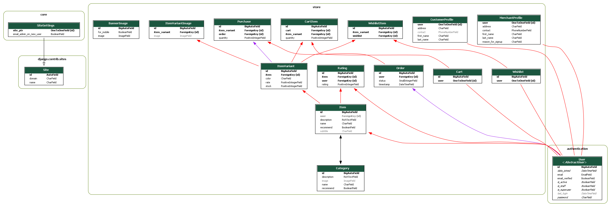

<div style="display: flex; align-items: center; gap: 1rem; margin-bottom: 2rem;">
    
</div>

The RESTful API for farmerz. Also includes a sleek admin interface.

## Developer guide

### Requirements

- [git v2.39](https://git-scm.com)
- [node v18.14LTS and npm ](https://nodejs.org/en/)
- [python v3.11](https://www.python.org/)
- [gettext v0.21.1](https://www.gnu.org/software/gettext/) (Optional but recommended. Needed to generate translation files)
- [graphviz v7.1.0](https://graphviz.org/) (Optional, required to generate model diagrams)

The version numbers are listed as a reference. As long as the major version is the same, everything should be fine. See [semanic versioning.](https://semver.org/)

### Installation

If you are reading this, you already have a copy of the repository. All commands are issued from the root of the repository, unless specified otherwise. Lines starting with `#` are comments and are not to be executed.

#### NPM

* Generate static files

```sh
npm install
npm run build
```

### Python

#### Setting up the virtual environment.

**You can skip/modify this section if you understand how virtual environments work and why they are needed.**

* Setup and switch to a python virtual environment.
```sh
python -m venv virtual
source virtual/bin/activate.ps1
```

#### Install dependencies via pip

```sh
pip install -r requirements.txt
```


#### Compile language translations (Optional)

Use this if you want to support other languages.

*GNU gettext utilities are a requirement for this section!* See [django docs](https://docs.djangoproject.com/en/4.1/topics/i18n/translation/#compiling-message-files) for more info.

```sh
python manage.py compilemessages -l ne
```

#### Create the database

```sh
python manage.py migrate
```
If you want to create a testing database, you can use the `populatetestdb` command. *Don't do this in production!*

```sh
python manage.py populatetestdb
```

#### Start the development server

```sh
python manage.py runserver
```

## Tests

You can run tests with

```sh
python manage.py test --pattern="tests_*.py"
```


## Documentation

The Browsable API (accessible through `/api`), and this document are the primary sources of documentation.

### Database structure



### Using the API

The API is extensively documented. The documentation is displayed in the browsable API (in development builds).

- API: [/api](http://localhost:8000/api)
- Admin Site: [/admin](http://localhost:8000/admin)

### How is the code organized?

The code is organized into several (mostly self-contained) apps.

1. `core`: Basic site related models (Site/SiteSettings)
1. `authentication` : Token based authentication and user model.
1. `store`: Core stuff related to store: `customer`, `items`, `order`, `category`, `purchase` etc.
1. `administrator`: The admin interface and relevant models.
1. `emails`: Mechanism to send emails on events

### Information regarding the test database

The email/password information is displayed when you populate the test database.

You can also refer to `administrator/management/populatetestdb.py` for any other information.

### Generating diagrams for the models

**Make sure graphviz is installed**

```
python manage.py graph_models -a -g -o static/shared/models.png
```

## Deployment

- Refer to the [documentation regarding deployment](https://docs.djangoproject.com/en/4.1/howto/deployment/) from django. Basic queries should be answered there.

- Copy the `.env.template` file into `.env`

```sh
cp .env.template .env
```

- Modify the .env file and fill in the details. Make sure to use the production settings!


```sh
export DJANGO_SETTINGS_MODULE = 'farmerz_api.production'
```

- You can generate a secret key with `generate_secret_key`

```python
python manage.py generate_secret_key
```

- Fill in the remaining contents of the `.env` file

**Note: You can provide the environment variables without using the .env file. But you have to make sure that .env file doesn't override your values! The file is sourced by `manage.py`. Make sure it is empty, if rolling your own solution.**

## Contributing

This project uses [precommit](https://pre-commit.com/).
Make sure to install the git hooks.
Additionally, make sure tests pass before pushing.

Refer to the developer guide for instructions to set up your environment.
